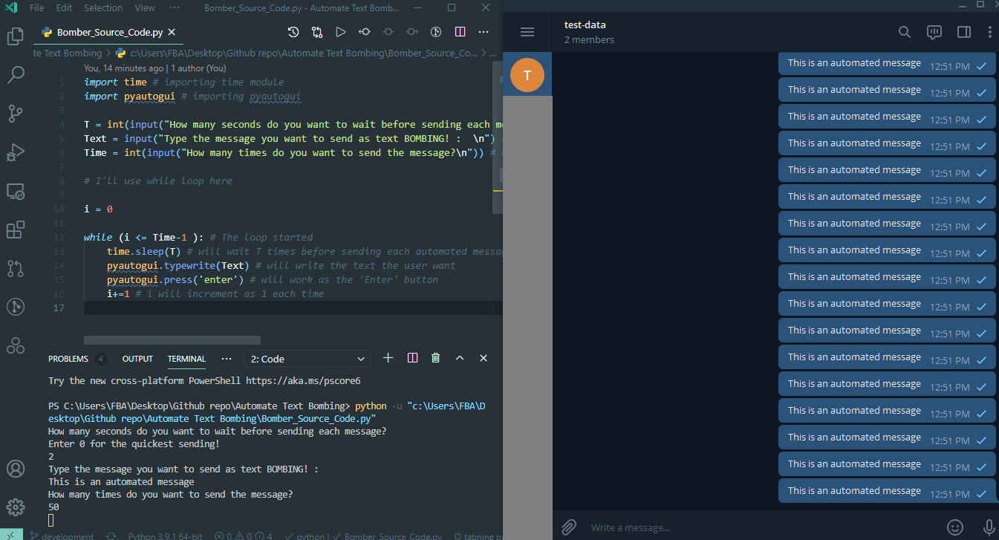

# Automate Text Bombing

# Automate Text Bombing

### You can use this Python code in anywhere you want to, whether it can be Facebook, messenger, WhatsApp, Telegram, Signal or anywhere else!

<br>

The original codebase is on [FahimFBA/Automate-Text-Bombing](https://github.com/FahimFBA/Automate-Text-Bombing).

<br>
<br>

## Follow these steps:
- Open the [Source Code](Bomber_Source_Code.py) to any IDE or Text Editor.
- Before running the code, open the text box where you want to send your automate bomb!
- If you find any error of PyAutoGui, then you may check the documentation of [PyAutoGui](https://pypi.org/project/PyAutoGUI/). If you find any other errors, then you'll find your solution in [Stack Overflow](https://stackoverflow.com/).
- For installing PyAutoGUI, run this command through your terminal:
 ```
 pip install pyautogui
 ```
- You're all set for running your BOMBER!
<br>
<br>
<br>

---------------------------------------------

<br>
<br>

## Follow these steps during running your Text BOMBER!

- Provide how many seconds you want to wait before sending each automated messages. Enter 0 for the quickest sending.
- Provide the text you want to send as an automated message bomb.
- Provide the amount of how many messages you want to send. You can send any amount of messages you want.
- Run the program and quickly take your cursor to the desired text box. For using the comment section of any media, click on the text box of the comment section. If you want to use this in any chat box, take the cursor to the chatbox and click on the text box for once.
- Voila! The Automated text bombing has been started!




<br>


[](https://github.com/FahimFBA/Automate-Text-Bombing/stargazers)


[](https://github.com/FahimFBA/Automate-Text-Bombing/network/members)


## Source Code: Bomber_Source_Code.py
```python
import time # importing time module
import pyautogui # importing pyautogui

T = int(input("How many seconds do you want to wait before sending each message?\nEnter 0 for the quickest sending!\n")) # Desired Time before sending each messages
Text = input("Type the message you want to send as text BOMBING! :  \n") # Desired Text
Time = int(input("How many times do you want to send the message?\n")) # How many messages the user want to send

# I'll use while loop here

i = 0

while (i <= Time-1 ): # The loop started
    time.sleep(T) # will wait T times before sending each automated message
    pyautogui.typewrite(Text) # will write the text the user want
    pyautogui.press('enter') # will work as the 'Enter' button
    i+=1 # i will increment as 1 each time

```
