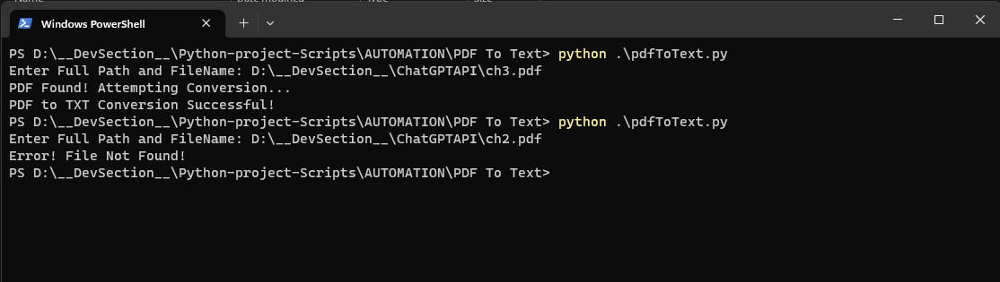

# PDF To Text

# Extracting Text from PDF using Python 

This project is aimed at extracting text from PDF files using Python.

## Getting Started

These instructions will get you a copy of the project up and running on your local machine for development and testing purposes.

### Prerequisites

Before running the script, you must install the appropriate dependencies. To install these dependencies, run the following command in your terminal.

```bash
pip install -r requirements.txt
```

### Using the Tool

Follow these steps to use the tool:

1. Run the 'pdfToText.py' script:

    ```bash
    python pdfToText.py
    ```

2. When prompted, provide the full path along with the file name of the PDF from which you want to extract text. For example:

    ```bash
    D:\FolderName\FileName.pdf
    ```

3. The data from the PDF will be extracted and stored in a .txt file in the same folder. For example:

    ```bash
    D:\FolderName\FileName.txt
    ```

### Error Handling

If any error is encountered during the process, it will be printed on the screen. For resolution, check the error message and debug accordingly.

Feel free to report any bugs or request features using the issue tracker.

## Example Run and Output

Below is a screenshot demonstrating how to run the commands in the terminal:




## Source Code: pdfToText.py
```python
from pathlib import Path
from PyPDF2 import PdfReader


def convert_pdf(filename):
    my_file = Path(filename)
    
    # Check if provided PDF file exists
    if not my_file.is_file():
        print('Error! File Not Found!')
        return None
    print('PDF Found! Attempting Conversion...')
    
    # Exception Handling during Data Extraction from PDF File
    try:
        # Define .txt file which will contain the extracted data 
        out_filename = my_file.with_suffix('.txt')
        # Extracting Data from PDF file page-by-page and storing in TXT file
        pdf_reader = PdfReader(filename)
        with open(out_filename, 'w', encoding='utf-8') as extracted_data:
            for page in pdf_reader.pages:
                text = page.extract_text()
                extracted_data.write(text)
        print('PDF to TXT Conversion Successful!')
        
    # If any Error is encountered, Print the Error on Screen
    except Exception as e:
        print(f'Error Converting PDF to Text or Saving Converted Text into .txt file: {e}')
        return None


if __name__ == '__main__':
    file = input('Enter Full Path and FileName: ')
    convert_pdf(file)
```
