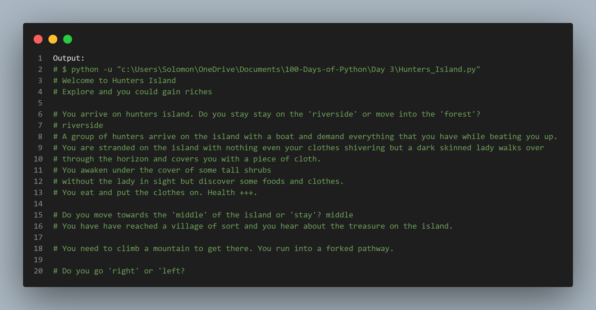

# Hunter_Island

# Title: "Hunters Island Adventure"

### Expected game output on the terminal

## Introduction:
Welcome to "Hunters Island Adventure," an interactive text-based game where you take on the role of a stranded individual on a mysterious island. Your choices will determine your fate, whether you find riches or face peril. This game is all about decision-making, so choose wisely!

### How to Play:

**Start:** `You arrive on Hunters Island. You have two options: "riverside" or "forest." Type your choice, and let the adventure begin!`

**Riverside:**

You stay by the riverside, but a group of hunters arrives on the island, demanding everything you have. They beat you up.
A mysterious lady covers you with a cloth, and you find food and clothes. Your health increases.
Choose between moving to the 'middle' of the island or 'stay.'
Middle of the Island:

You reach a village and learn about the island's treasure.
You face a forked pathway. Choose to go 'right' or 'left.'
Right Path:

You find an ancient castle with three doors: 'modern,' 'scratched,' and 'metal.'
Choose a door, and your fate will be revealed.
Scratched Door:

Congratulations! You found the treasure chest!
Any other door choice:

You face various perils, and the game ends in failure.
Left Path or Any Other Choices:

Different challenges and outcomes await you, potentially leading to failure.

**Forest:**

You enter the forest, avoiding the hunters.
You overhear the hunters talking about a treasure map.
Decide whether to 'steal' the map or head to the 'middle' of the island.
Middle of the Island (same as the Riverside Path):

You reach the village, face a forked pathway, and ultimately discover the treasure's location.

**Conclusion:**

The game has multiple possible endings, depending on your choices.
Make strategic decisions to explore the island, avoid danger, and, hopefully, find the hidden treasure.

**Game Over:**
Be cautious; there are numerous ways for the game to end in failure or even death.
Enjoy your adventure on Hunters Island, and may you uncover the legendary treasure!

## Source Code: Hunters_Island.py
```python
print("Welcome to Hunters Island\nExplore and you could gain riches\n")

question1 = input("You arrive on hunters island. Do you stay stay on the 'riverside' or move into the 'forest'?\n")

question1 = question1.lower()
if question1 == 'riverside':
    print("A group of hunters arrive on the island with a boat and demand everything that you have while beating you up.")
    question2 = input('''You are stranded on the island with nothing even your clothes shivering but a dark skinned lady walks over
through the horizon and covers you with a piece of cloth.\nYou awaken under the cover of some tall shrubs 
without the lady in sight but discover some foods and clothes.\nYou eat and put the clothes on. Health +++.
\nDo you move towards the 'middle' of the island or 'stay'? ''')
    question2 = question2.lower()
    if question2 == 'middle':
        question3 = input('''You have have reached a village of sort and you hear about the treasure on the island.\n
You need to climb a mountain to get there. You run into a forked pathway.
\nDo you go 'right' or 'left?\n''')
        question3 = question3.lower()
        if question3 == 'right':
            treasure = input("You find an ancient castle with 3 rooms that have three doors, which do you enter: 'modern' door, 'scratched' door and 'metal' door?\n")
            treasure = treasure.lower()
            if treasure == 'scratched':
                print("You found the treasure chest!!!")
            else:
                print("Lost in a vortex\nGame Over!!!")
        else:
            print("Fell into a trap.\nGame Over")
    else:
        print("A tiger appears and kills you.\nGame Over")
            
elif question1 == 'forest':
    print("You entered the forest just as a group of hunters arrive on the island, so you were able to hide from them.")
    question4 = input("You listen in on them and find out that they have a map to the treasure on the island.\nDo you 'steal' it or leave them alone and head to the 'middle' of the island?\n")
    question4 = question4.lower()
    if question4 == 'middle':
        question3 = input('''You have have reached a village of sort and you hear about the treasure on the island.\n
You need to climb a mountain to get there. You run into a forked pathway.
\nDo you go 'right' or 'left?\n''')
        question3 = question3.lower()
        if question3 == 'right':
            treasure = input("You find an ancient castle with 3 rooms that have three doors, which do you enter: 'modern' door, 'scratched' door and 'metal' door?\n")
            treasure = treasure.lower()
            if treasure == 'scratched':
                print("You found the treasure chest!!!")
            else:
                print("Lost in a vortex\nGame Over!!!")
        else:
            print("Fell into a trap.\nGame Over")
    else:
        print("They kill you.\nGame Over")
else:
    print("You try to swim away since the boat that brought you has left but you end up in the belly of a shark.\nGame Over")
```
