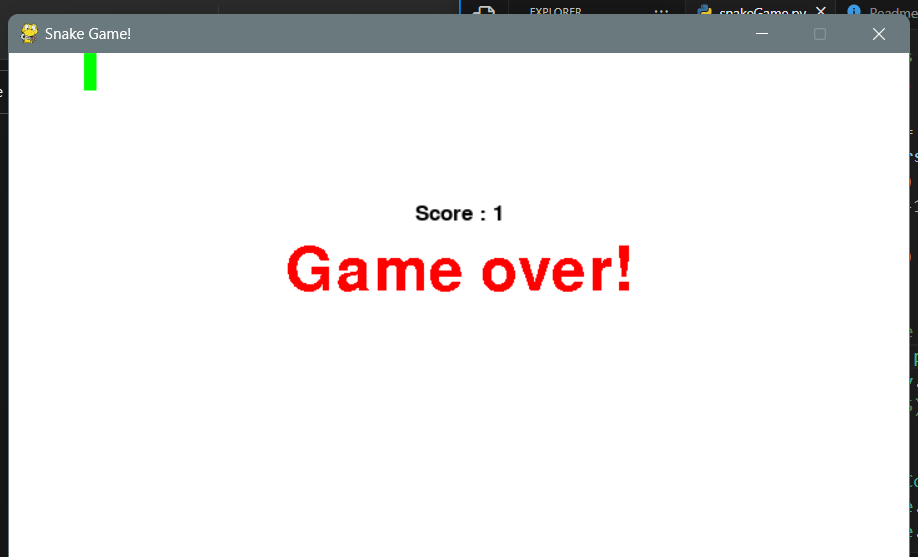

# snakeGame

# Snake Game

A classic Snake Game implemented in Python using the Pygame library.



## Table of Contents

- [Description](#description)
- [Features](#features)
- [Installation](#installation)
- [How to Play](#how-to-play)
- [Controls](#controls)
- [Contributing](#contributing)

## Description

This is a simple implementation of the classic Snake Game using Python and Pygame. The game starts with a single snake that you control using arrow keys or WASD keys. Your goal is to eat the brown squares (food) to grow longer while avoiding collisions with the game boundaries and the snake's own body. The game ends if you run into a wall or collide with yourself.

## Features

- Classic Snake Game experience.
- Simple and intuitive controls.
- Score tracking to see how well you've done.
- Game over screen with your final score.

## Installation

1. Clone the repository:

   ```
   git clone https://github.com/sahilrw/snake-game.git
   ```

2. Navigate to the project directory:

   ```
   cd snake-game
   ```

3. Install the required dependencies:

   ```
   pip install pygame
   ```

4. Run the game:

   ```
   python snakeGame.py
   ```

## How to Play

- Use the arrow keys (Up, Down, Left, Right) or WASD keys (W, A, S, D) to control the snake's direction.
- Eat the brown squares (food) to grow longer.
- Avoid running into the game boundaries or colliding with the snake's own body.
- Try to achieve the highest score possible before the game ends.

## Controls

- Arrow Keys (Up, Down, Left, Right) or
- WASD Keys (W, A, S, D)

## Contributing

Contributions are welcome! If you find any issues or have suggestions for improvement, please open an issue or create a pull request.


## Source Code: snakeGame.py
```python
# Snake Game!

# Game imports
import pygame, sys, random, time

check_errors = pygame.init()
if check_errors[1] > 0:
    print("(!) Had {0} initializing errors, exiting...".format(check_errors[1]))
    sys.exit(-1)
else:
    print("(+) PyGame successfully initialized")


# Play Surface
playSurface = pygame.display.set_mode((720, 700))
pygame.display.set_caption("Snake Game!")
# time.sleep(5)

# Colors
red = pygame.Color(255, 0, 0)  # gameover
green = pygame.Color(0, 255, 0)  # snake
black = pygame.Color(0, 0, 0)  # score
white = pygame.Color(255, 255, 255)  # background
brown = pygame.Color(165, 42, 42)  # food

# FPS controller
fpsController = pygame.time.Clock()

# Position of the snake
snakePos = [100, 50]
snakeBody = [[100, 50], [90, 50], [80, 50]]

foodPos = [random.randrange(1, 72) * 10, random.randrange(1, 70) * 10]
foodSpawn = True

direction = "RIGHT"
changeto = direction

score = 0


# Game over function
def gameOver():
    myFont = pygame.font.SysFont("monaco", 72)
    GOsurf = myFont.render("Game over!", False, red)
    GOrect = GOsurf.get_rect()
    GOrect.midtop = (360, 150)
    playSurface.blit(GOsurf, GOrect)
    showScore(0)
    pygame.display.flip()
    time.sleep(5)
    pygame.quit()  # for exiting pygame
    sys.exit()  # for exiting from the console


def showScore(choice=1):
    scoreFont = pygame.font.SysFont("monaco", 25)
    scoreSurf = scoreFont.render("Score : {0}".format(score), True, black)
    scoreRect = scoreSurf.get_rect()
    if choice == 1:
        scoreRect.midtop = (80, 10)
    else:
        scoreRect.midtop = (360, 120)
    playSurface.blit(scoreSurf, scoreRect)


# Main Logic of the game
while True:
    for event in pygame.event.get():
        if event.type == pygame.QUIT:
            pygame.quit()
            sys.exit()
        elif event.type == pygame.KEYDOWN:
            if event.key == pygame.K_RIGHT or event.key == ord("d"):
                changeto = "RIGHT"
            if event.key == pygame.K_LEFT or event.key == ord("a"):
                changeto = "LEFT"
            if event.key == pygame.K_UP or event.key == ord("w"):
                changeto = "UP"
            if event.key == pygame.K_DOWN or event.key == ord("s"):
                changeto = "DOWN"
            if event.key == pygame.K_ESCAPE:
                pygame.event.post(pygame.event.Event(pygame.QUIT))

    # validation of direction
    if changeto == "RIGHT" and not direction == "LEFT":
        direction = "RIGHT"
    if changeto == "LEFT" and not direction == "RIGHT":
        direction = "LEFT"
    if changeto == "UP" and not direction == "DOWN":
        direction = "UP"
    if changeto == "DOWN" and not direction == "UP":
        direction = "DOWN"

    # Update snake position [x, y]
    if direction == "RIGHT":
        snakePos[0] += 10
    if direction == "LEFT":
        snakePos[0] -= 10
    if direction == "UP":
        snakePos[1] -= 10
    if direction == "DOWN":
        snakePos[1] += 10

    # Snake body mechanism
    snakeBody.insert(0, list(snakePos))
    if snakePos[0] == foodPos[0] and snakePos[1] == foodPos[1]:
        score += 1
        foodSpawn = False
    else:
        snakeBody.pop()

    if foodSpawn == False:
        foodPos = [random.randrange(1, 72) * 10, random.randrange(1, 70) * 10]
    foodSpawn = True

    playSurface.fill(white)
    for pos in snakeBody:
        pygame.draw.rect(playSurface, green, pygame.Rect(pos[0], pos[1], 10, 10))

    pygame.draw.rect(playSurface, brown, pygame.Rect(foodPos[0], foodPos[1], 10, 10))
    if snakePos[0] > 710 or snakePos[0] < 0:
        gameOver()
    if snakePos[1] > 690 or snakePos[1] < 0:
        gameOver()

    for block in snakeBody[1:]:
        if snakePos[0] == block[0] and snakePos[1] == block[1]:
            gameOver()
    showScore()
    pygame.display.flip()
    fpsController.tick(18)

```
