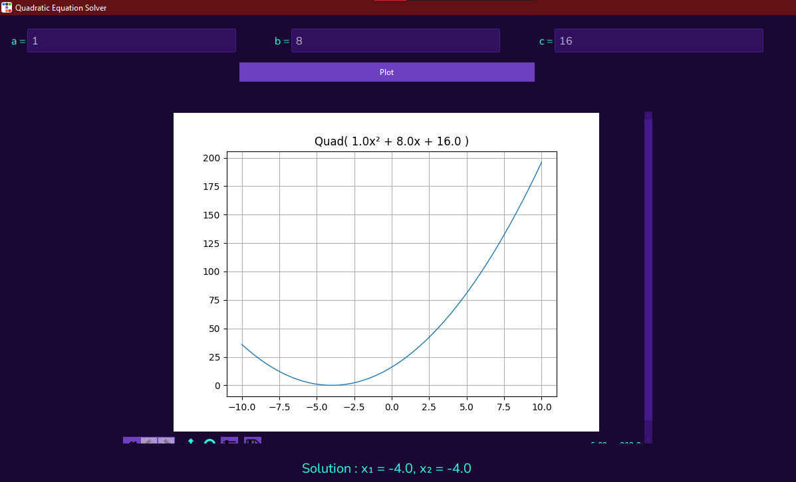

# Quadratic-Equation-Solver

# Quadratic equation solver



## Requirements
```powershell
numpy : 1.24.2
matplotlib : 3.6.3
ttkbootstrap : 1.10.1
tkinter: "inbuilt", 8.6
```

A simple quadratic equation solver with ttkbootstrap as GUI

- A Quadratic class was created to ease GUI use

## `Class Quadratic`
A quadratic class recieves 3 arguments (a,b,c) according to 
ax² + bx + c
```python
q1 = Quadratic(a = 2, b = 4, c = 5)
```
## Methods
### The solve quad method solves a quadratic expression assuming the expression is equal to 0  
 > returns a tuple of two numbers
 ```python
 q1 = Quadratic(a = 1, b = 8, c = 16)
 print(q1.solveQuad())

 # returns 4, 4
 ```
 > Where the determinant is less than zero, a complex number solution is returned `python3 supports complex numbers`

### The evaluate method replaces the x in  ax² + bx + c with an integer or float and returns the calculated value
 ```python
 q1 = Quadratic(a = 1, b = 8, c = 16)
 print(q1.evaluate(value = 2))

 # returns 36
 ```
### The draw figure method draws a quadratic equation graph using numpy and matplotlib 
 > `numpy and matplotlib required` see requirements section above
 ```python
 q1 = Quadratic(a = 1, b = 8, c = 16)
 print(q1.drawFigure())

 # returns 4, 4
 ```
 > A matplotlib figure is  returned and can be added to a matplotlib graph


## Source Code: quad.py
```python
import matplotlib.pyplot as plt
import numpy as np


class Quadratic:
    """Representing a quadratic expression in the form of ax² + bx + c"""
    
    def __init__(self,a : float, b : float, c : float) -> None:
        # A class is created succesfully if the arguments of the class are either of float type or int type
        if (type(a) == type(0.1) or type(a) == type(1)) and (type(b) == type(0.1) or type(b) == type(1)) and (type(c) == type(0.1) or type(c) == type(1)):
            self.a = a
            self.b = b
            self.c = c
        else:
            raise ValueError("Argument must be of type int or float")
    
    def __repr__(self) -> str:
        """ Printing a quadratic class """
        return "Quad( {0}x² + {1}x + {2} )".format(self.a,self.b,self.c)
    
    def solveQuad(self) -> tuple[float,float]:
        """Solving the expression assuming it is equal to 0. 
        returns a tuple of 2 values"""

        determinant = ((self.b ** 2) - (4 * self.a * self.c)) ** 0.5 # The determinant of a quadratic equation is the root of b² - 4ac
        firstSolution = ((-1 * self.b) + determinant) / (2 * self.a)
        secondSolution = ((-1 * self.b) - determinant) / (2 * self.a)
        return (firstSolution,secondSolution)
    
    def evaluate(self, value):
        """Evaluate the Quadratic expression. with x in ax² + bx + c as a numeric type"""
        solution = ((self.a * (value ** 2)) + (self.b * value) + self.c)
        return solution
    
    def drawFigure(self):
        """Draws a quadratic graph of the quadratic expression and returns a matplotlib figure"""
        x_axis = np.linspace(-10,10,50)
        y_axis = self.evaluate(x_axis)
        
        figure, axes = plt.subplots()
        
        axes.plot(x_axis,y_axis, linewidth = 1)
        axes.grid(visible = True)
        axes.set_title(self)
        axes.xaxis.set_minor_formatter(str(x_axis))
        return figure


```
